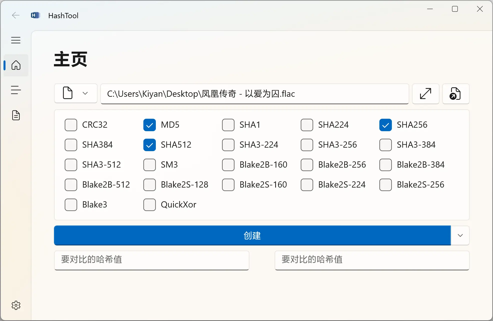

  

# HashTool

**用于计算和校验文件、文件夹或文本哈希值的工具！**

**A Tool for Calculating and Verifying the Hash Value of Any File, Folder, or Text!**

---

## 特性

- 可以计算文件，文件夹或文本的哈希值。
- 支持 MD5, SHA1, SHA2, SHA3 等多种哈希算法，详见 [wiki](https://github.com/KiyanYang/DotVast.HashTool.WinUI/wiki/功能#哈希算法)。
- 支持拖放文件和文件夹。
- 现代化且友好的界面。
- 支持简体中文和英语。

## 使用

1. 打开 [系统设置 > 隐私和安全性 > 开发者选项](ms-settings:developers)，启用 `开发人员模式`，并展开下方的 `PowerShell`，启用`更改执行策略，以允许本地 PowerShell 脚本在未签名的情况下运行。远程脚本需要签名。`。
2. 在右侧的 [Release](https://github.com/KiyanYang/DotVast.HashTool.WinUI/releases) 中，找到最新版本，并下载适用于当前系统的压缩包。
3. 解压压缩包，右击 `Install.ps1` 脚本，选择“使用 PowerShell 运行”，根据提示进行安装。

## 界面

## 贡献

欢迎参与 DotVast.HashTool.WinUI 项目，您可以在 [Discussions](https://github.com/KiyanYang/DotVast.HashTool.WinUI/discussions) 进行讨论， 如果您有任何反馈，请提交 [Issue](https://github.com/KiyanYang/DotVast.HashTool.WinUI/issues/new/choose) 或 PR。

## 感谢

- 工具
  - [Visual Studio Community 2022](https://visualstudio.microsoft.com/vs/community/)
  - [.NET](https://dotnet.microsoft.com/)
  - [Template Studio](https://github.com/microsoft/TemplateStudio)

- 项目
  - [HashLib4CSharp](https://github.com/Xor-el/HashLib4CSharp)
  - [CryptoBase](https://github.com/HMBSbige/CryptoBase)
  - [CommunityToolkit.Mvvm](https://github.com/CommunityToolkit/dotnet)
  - [CommunityToolkit.WinUI](https://github.com/CommunityToolkit/WindowsCommunityToolkit)
  - [Microsoft.WindowsAppSDK](https://github.com/microsoft/WindowsAppSDK)
  - [Microsoft.Extensions](https://github.com/dotnet/runtime)
  - [Serilog](https://github.com/serilog/serilog)
  - [WinUIEx](https://github.com/dotMorten/WinUIEx)

- 代码片段
  - [QuickXorHash.cs](https://gist.github.com/rgregg/c07a91964300315c6c3e77f7b5b861e4)
