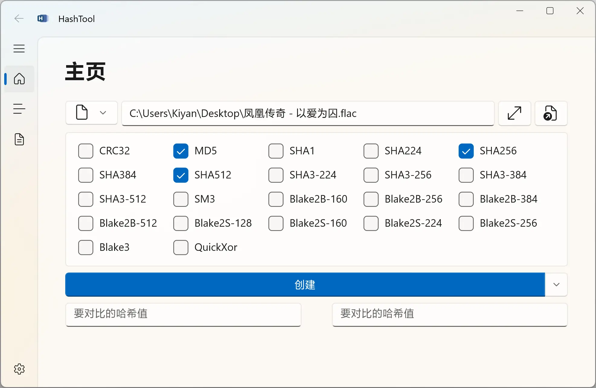

  

# HashTool

**A Tool for Calculating Hash Values of Files or Folders!**

---

> [简体中文](./docs/README.zh-Hans.md)

DotVast.HashTool.WinUI allows you to calculate the hash values of files or folders. It is a useful tool for verifying the integrity and authenticity of your data.

## Features

- Calculate the hash values of files or folders.
- Support MD5, SHA1, SHA2, SHA3 and so on. See [wiki](https://github.com/KiyanYang/DotVast.HashTool.WinUI/wiki/功能#哈希算法) for more details.
- Support drag and drop files and folder.
- Modern and friendly user interface.
- Support multiple languages.

## Installation

You can download the latest release from the [GitHub Releases](https://github.com/KiyanYang/DotVast.HashTool.WinUI/releases) page. Alternatively, you can clone this repository and build the project yourself using Visual Studio 2022 or later.

## Screenshots

## Contribution

If you find any bugs or have any suggestions for improvement, please feel free to open an issue or a pull request on GitHub after reading the [contribution guide](./CONTRIBUTING.md). You can also fork this repository and make your own modifications. If you like this project, please consider giving it a star on GitHub to show your support.

## License

DotVast.HashTool.WinUI is licensed under the MIT License. See [LICENSE](./LICENSE.txt) for more details.
