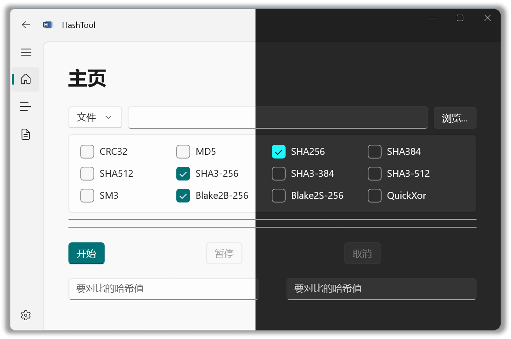

  

# HashTool

#### 用于计算和校验文件、文件夹或文本哈希值的工具！

#### A Tool for Calculating and Verifying the Hash Value of Any File, Folder, or Text!

---

HashTool 支持文件、文件夹或文本的哈希计算。

## 使用

打开 [系统设置 > 隐私和安全性 > 开发者选项](ms-settings:developers)，启用 `开发人员模式`。

之后打开右侧的 [Release](https://github.com/KiyanYang/DotVast.HashTool.WinUI/releases) 页面，找到最新版本，并选择适用于当前系统的安装包下载。下载完成后，解压压缩包，右击 `Install.ps1` 脚本，选择“使用 PowerShell 运行”，根据提示进行安装。

## 界面

## 感谢

- 工具
  - [Visual Studio Community 2022](https://visualstudio.microsoft.com/zh-hans/vs/community/)
  - [.NET 6](https://docs.microsoft.com/zh-cn/dotnet/api/?view=net-6.0)

- 项目
  - [dotnet/Runtime](https://github.com/dotnet/runtime)
  - [CommunityToolkit.Mvvm](https://github.com/CommunityToolkit/dotnet)
  - [HashLib4CSharp](https://github.com/Xor-el/HashLib4CSharp)

- 代码片段
  - [QuickXorHash.cs](https://gist.github.com/rgregg/c07a91964300315c6c3e77f7b5b861e4)
